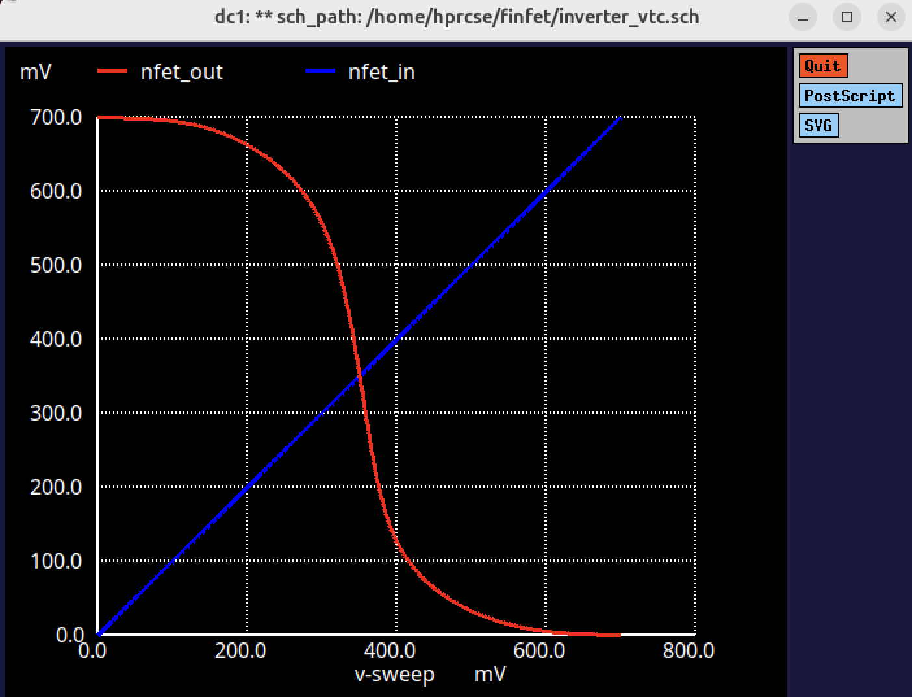

# Designing a Bandgap reference circuit with SCMB configuration using ASAP 7nm PDk
## contents 
## Introduction 

### Week 1 - Research Paper on Bandgap Circuit using ASAP 7nm PDK 

#### What is Finfet? 
The definition of a Finfet by Synopsys is " 
A FinFET is a type of field-effect transistor (FET) that has a thin vertical fin instead of being completely planar. The gate is fully “wrapped” around the channel on three sides formed between the source and the drain. The greater surface area created between the gate and channel provides better control of the electric state and reduces leakage compared to planar FETs. Using FinFETs, results in much better electrostatic control of the channel and thus better electrical characteristics than planar FETs." 
FinFETs serve as the foundation for contemporary nanoelectronic semiconductor device manufacturing. These microchips, which employ FinFET technology, were commercialized in the early 2010s and became the primary gate design for process nodes at 14 nm, 10 nm, and 7 nm. Typically, a single FinFET transistor consists of multiple fins positioned side by side, all enveloped by the same gate, allowing them to function electrically as a single unit to enhance drive strength and performance.
<picture>

</picture>

#### What is Bandgap reference voltage ? 
A bandgap reference voltage is a voltage source that generates an output voltage proportional to the bandgap energy of a semiconductor. The most commonly used bandgap references are based on silicon (Si), which typically produce an output of around 1.2 V. Gallium arsenide (GaAs) can also be utilized to create a reference source with a higher output voltage due to its wider bandgap of 1.42 eV, as shown in a recent research study. In theory, any semiconductor can be employed to develop a bandgap voltage reference, provided it can be deposited on standard wafer materials.

#### Bandgap reference circuit with SCMB 
The BGR is essential for providing a stable reference voltage that remains consistent regardless of temperature, supply voltage, and process variations. A Self-Biased Current Mirror (SBCM)-based BGR is used , which improves upon traditional designs that combine Proportional-to-Absolute-Temperature (PTAT) and Complementary-to-Absolute-Temperature (CTAT) voltages. The SBCM architecture enhances scalability and is particularly advantageous for low-power, high-precision applications. The SBCM design negates the need for external biasing through an internal feedback mechanism. Key challenges include managing temperature sensitivity and supply voltage sensitivity in the 7 nm process. The SBCM architecture mitigates temperature dependence by effectively balancing PTAT and CTAT voltages while addressing issues related to low-voltage operation.

#### ASAP 7nm PDK 


### Week 2 - Characterization of CMOS VTC 

#### Nfet Id and Vd Characteristics 

#### CMOS Inverter_vtc Characteristics 
##### 2.1 W/L Ratio 

The week 2 session starts with calculation of W/L ratio which is important in the CMOS because it has a direct impact on the transistor's electrical properties, such as its current drive capability, switching speed, and power consumption. This ratio essentially dictates the overall performance and efficiency of the entire circuit design. For 7nm PDK we would be varying only ```nfins``` for npmos and nnmos in the spice circuit. The length is going to be constant which is 7nm. We start with varying the nfins value and calculating the other parameters 

##### 2.2 Switching Threshold voltage. 

The switching threshold, denoted as ```V_th```, is defined as the point where the input voltage ```nfet_in``` equals the output voltage ```nfet_out```. The ratio of the relative driving strengths of the PMOS and NMOS transistors determines this switching threshold. To raise ```V_th```, a larger ratio is needed, which involves widening the PMOS transistor. Conversely, enhancing the strength of the NMOS transistor will shift the switching threshold closer to ground (GND).

Spice command for calculating V_th 
``` meas dc v_th when nfet_out=nfet_in``` 

##### 2.3 Drain Current Id 

Drain current (𝐼𝐷) is the current that flows from the drain terminal to the source terminal in a field-effect transistor (FET). It is primarily controlled by the voltage applied at the gate terminal, which creates an electric field that modulates the conductivity of the channel between the drain and source. As the gate voltage increases, the channel becomes more conductive, allowing more current to flow from the drain to the source. In the saturation region, the drain current reaches a constant value, independent of the drain-source voltage, while in the triode region, it increases linearly with the drain-source voltage. The drain current is a key parameter in determining the performance of transistors in various applications, such as amplifiers and digital circuits. 

Here the drain current is calculated using ```v2#branch current ```. We can get this by using ``` display ``` in NGSPICE. 
The commands that were used to plot Id  
```
let id=v2#branch
plot id

```
<picture>

</picture>

##### 2.4 Gate Capacitance 

##### 2.5 Power Consumption 

#### 2.6 Propagation Delay (Tp) 

The propagation delay of a logic gate e.g. inverter is the difference in time (calculated at 50% of input-output transition), when output switches, after application of input. Rise time (tr) is the time, during transition, when output switches from 10% to 90% of the maximum value. Fall time (tf) is the time, during transition, when output switches from 90% to 10% of the maximum value. Many designs could also prefer 30% to 70% for rise time and 70% to 30% for fall time. It could vary upto different designs.

Spice Commands 
```
meas tran tpr when nfet_in=0.35 RISE=1 : Measures the rise time (tpr) when the input voltage reaches 0.35V
meas tran tpf when nfet_out=0.35 FALL=1 : Measures the fall time (tpf) when the output voltage reaches 0.35V. 
let tp = (tpf + tpr)/2 : Calculates the average propagation delay (tp) as the mean of the rise and fall times.
print tp : prints the Propagation Delay

```

##### 2.7 Gain (Av) 

Gain is defined as Change in output voltage to that of input voltage. 
Spice Commands to calculate gain 
```
let gain_av=deriv(nfet_out) : this gives out negative gain
** to get abs gain we can use

let gain_av=abs(deriv(nfet_out)) : Gives the absolute value of gain.
plot gain
```

##### 2.8 Noise Margin 

Noise margin in a CMOS voltage transfer characteristic (VTC) refers to the tolerance a digital circuit has to noise before signal integrity is compromised. It is defined by two key metrics: Noise Margin High (NMH) and Noise Margin Low (NML). NMH is the difference between the minimum output high voltage (VOH) and the minimum input high voltage (VIH) required to recognize a logic high signal. NML is the difference between the maximum output low voltage (VOL) and the maximum input low voltage (VIL) required to recognize a logic low signal. Larger noise margins ensure the circuit is more resistant to voltage fluctuations or noise, maintaining proper logic level detection.

Spice Commands: 

```
meas dc vil find nfet_in when nfet_out=gain CROSS=1   : Measures the (vil, the "input low voltage") when (nfet_out) crosses the gain value for the first time (CROSS=1).
meas dc voh find nfet_out when nfet_out=gain CROSS=1  : Measures the (voh, the "output high voltage") at the same crossing point as vil. 
meas dc vih find nfet_in when nfet_out=gain CROSS=2   : Measures the (vih, the "input high voltage") when the output voltage crosses the gain value for the second time (CROSS=2). 
meas dc vol find nfet_out when nfet_out=gain CROSS=2  : Measures the (vol, the "output low voltage") at the second crossing point. This represents the low state of the output.

let nmh=voh-vih                                       : Calculates the noise margin high (nmh)
print nmh                                             : Prints the calculated noise margin high.
let nml=vil-vol                                       : Calculates the noise margin low (nml)
print nml                                             : Prints the calculated noise margin low.

```

##### 2.9 Transconductance (Gm) 

Transconductance is defined as the ratio of change in drain current and change in Vgs (Gate-source Voltage). In our case, we already have drain current and VGS is input voltage which is ```nfet_in```. 

Spice commands 
```
let gm = real(deriv(id, nfet_in)) : Calculates the transconductance (gm) as the derivative of the branch current with respect to the input voltage.
meas dc gm_max MAX gm: Measures the maximum transconductance (gm_max).
plot gm

````
The below graph is not the absolute value, for positive results please use abs command. 

##### 2.10 Frequency (f) 

In this case, the maximum signal frequency was calculated, using delay time. As disscussed above about rise time (tr) and fall time (tf). So the frequency would be 1/(tr+tf) 
Spice commands used for this : 
```
tran 0.1 100p                          : Performs a transient analysis with a time step of 0.1ns and a total simulation time of 100ps.
meas tran tr when nfet_in=0.07 RISE=1  : Measures the rise time (tr) when the input voltage reaches 0.07V.
meas tran tf when nfet_out=0.63 FALL=1 : Measures the fall time (tf) when the output voltage reaches 0.63V.
let t_delay = tr + tf                  : Calculates the total delay time as the sum of rise and fall times.
print t_delay                          : Prints the total delay time.
let f = 1/t_delay                      : Calculates the frequency (f) as the reciprocal of the total delay time.
print f                                : Prints the frequency.

```

##### 2.11 Output Resistance  

The output resistance is defined as the ratio of output node voltage and the change in drain current. So here we are taking derivative of output voltage and derivative of the drain current. 
Spice commands: 

```
let r_out= deriv(nfet_out,id)   : Calculates the output resistance by taking the derivative of the output voltage with respect to the branch current.
plot r_out                      : Plots the output resistance.

```

##### Characteristics Table 

```
| Sr. no | W (Width) pMOS (nm) | L (Length) pMOS (nm) | W/L Ratio pMOS | W (Width) nMOS (nm) | L (Length) nMOS (nm) | W/L Ratio nMOS | Switching Threshold Voltage (VTC) (mV) | Drain Current (Id) (µA) | Gate Capacitance (Cg) | Power Consumption (P) | Propagation Delay (t_pd) (ps) | Gain (Av)                 | Noise Margin (NM)        | Transconductance (gm) (x10^-3) | Frequency (f) (GHz) | Output Resistance (Ro) |
|--------|---------------------|----------------------|----------------|---------------------|----------------------|----------------|---------------------------------------|------------------------|---------------------|---------------------|----------------------------|--------------------------|--------------------------|--------------------------|-----------------------|-------------------------|
| 1      | 10                  | 7                    | 1.43           | 14                  | 7                    | 2              | 321.54                                | 191.1                  | 2.674e-17           | 0.2511              | 6.418                     | NMH=0.2355V, NML=0.1346V | 9.695                   | 22.592                   | 6.4122                |                         |
| 2      | 11                  | 7                    | 1.57           | 15                  | 7                    | 2.14           | 323.35                                | 208.112                | 2.908e-17           | 0.2513              | 6.4734                    | NMH=0.2334V, NML=0.1361V | 1.059                   | 22.584                   | 6.4736                |                         |
| 3      | 16                  | 7                    | 2.29           | 15                  | 7                    | 2.14           | 349.25                                | 249.45                 | 3.525e-17           | 0.2538              | 6.4268                    | NMH=0.1870V, NML=0.1761V | 1.384                   | 22.429                   | 6.4265                |                         |
| 4      | 17                  | 7                    | 2.43           | 15                  | 7                    | 2.14           | 353.43                                | 256.272                | 3.622e-17           | 0.25409             | 6.4292                    | NMH=0.1811V, NML=0.185V  | 1.441                   | 22.393                   | 6.4292                |                         |
| 5      | 17                  | 7                    | 2.43           | 16                  | 7                    | 2.29           | 348.98                                | 265.612                | 3.754e-17           | 0.2537              | 6.427                     | NMH=0.1877V, NML=0.1761V | 1.472                   | 22.431                   | 6.4271                |                         |
| 6      | 17                  | 7                    | 2.43           | 17                  | 7                    | 2.43           | 344.78                                | 274.515                | 3.877e-17           | 0.2347              | 6.4285                    | NMH=0.1958V, NML=0.1685V | 1.5                     | 22.463                   | 6.4284                |                         |
| 7      | 16                  | 7                    | 2.29           | 17                  | 7                    | 2.43           | 340.58                                | 266.85                 | 3.763e-17           | 0.2531              | 6.43115                   | NMH=0.2029V, NML=0.1619V | 1.438                   | 22.492                   | 6.4311                |                         |
| 8      | 17                  | 7                    | 2.43           | 14                  | 7                    | 2              | 351.19                                | 246.447                | 3.4822e-17          | 0.2543              | 6.4339                    | NMH=0.1730V, NML=0.1960V | 1.408                   | 22.349                   | 6.4339                |                         |
| 9      | 16                  | 7                    | 2.29           | 14                  | 7                    | 2              | 354.01                                | 240.063                | 3.39e-17            | 0.2541              | 6.42865                   | NMH=0.17988V, NML=0.17683V| 1.3533                 | 22.388                   | 6.42865               |                         |
| 10     | 16                  | 7                    | 2.29           | 15                  | 7                    | 2.14           | 349.25                                | 249.4516               | 3.53e-17            | 0.2538              | 6.42865                   | NMH=0.1870V, NML=0.1768V | 1.384                   | 22.429                   | 6.42865               |                         |
| 11     | 16                  | 7                    | 2.29           | 16                  | 7                    | 2.29           | 354.01                                | 240.064                | 3.39e-17            | 0.2541              | 6.42865                   | NMH=0.1798V, NML=0.1838V  | 1.3533                 | 22.388                   | 6.42865               |                         |
| 12     | 15                  | 7                    | 2.14           | 14                  | 7                    | 2              | 349.5                                 | 241.65                 | 3.29e-17            | 0.2538              | 6.4272                    | NMH=0.1874V, NML=0.1764V | 1.295                   | 22.426                   | 6.4275                |                         |
| 13     | 15                  | 7                    | 2.14           | 15                  | 7                    | 2.14           | 344.78                                | 242.21                 | 3.42e-17            | 0.2534              | 6.4283                    | NMH=0.1958V, NML=0.16851V| 1.32                    | 22.463                   | 6.4285                |                         |
| 14     | 14                  | 7                    | 2              | 15                  | 7                    | 2.14           | 340.41                                | 234.53                 | 3.307e-17           | 0.25307             | 6.4628                    | NMH=0.2033V, NML=0.1617V  | 1.26                    | 22.496                   | 6.4326                |                         |
| 15     | 13                  | 7                    | 1.86           | 14                  | 7                    | 2              | 339.65                                | 218.36                 | 3.07e-17            | 0.25304             | 6.4323                    | NMH=0.2038V, NML=0.1611V  | 1.173                   | 22.498                   | 6.4324                |                         |
| 16     | 14                  | 7                    | 2              | 13                  | 7                    | 1.86           | 349.913                               | 217.122                | 3.06e-17            | 0.2538              | 6.4279                    | NMH=0.186V, NML=0.176V    | 1.207                   | 22.423                   | 6.4279                |                         |
| 17     | 15                  | 7                    | 2.14           | 13                  | 7                    | 1.86           | 354.52                                | 223.85                 | 3.16e-17            | 0.2541              | 6.4299                    | NMH=0.178V, NML=0.185V    | 1.24                    | 22.429                   | 6.4294                |                         |


```


     

