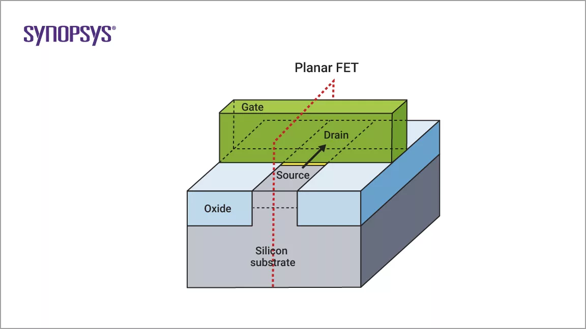

# Designing a Bandgap reference circuit with SCMB configuration using ASAP 7nm PDk
## contents 
## Introduction 
### Week 1 - Research Paper on Bandgap Circuit 
#### What is Finfet? 
The definition of a Finfet by Synopsys is " 
A FinFET is a type of field-effect transistor (FET) that has a thin vertical fin instead of being completely planar. The gate is fully “wrapped” around the channel on three sides formed between the source and the drain. The greater surface area created between the gate and channel provides better control of the electric state and reduces leakage compared to planar FETs. Using FinFETs, results in much better electrostatic control of the channel and thus better electrical characteristics than planar FETs." 
FinFETs serve as the foundation for contemporary nanoelectronic semiconductor device manufacturing. These microchips, which employ FinFET technology, were commercialized in the early 2010s and became the primary gate design for process nodes at 14 nm, 10 nm, and 7 nm. Typically, a single FinFET transistor consists of multiple fins positioned side by side, all enveloped by the same gate, allowing them to function electrically as a single unit to enhance drive strength and performance.
<picture>

</picture>
